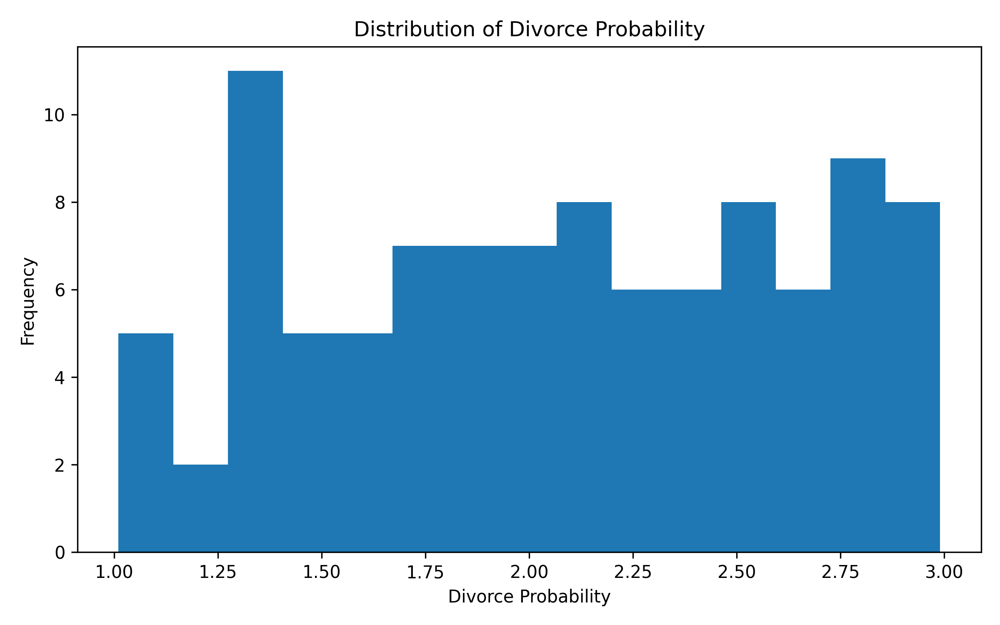
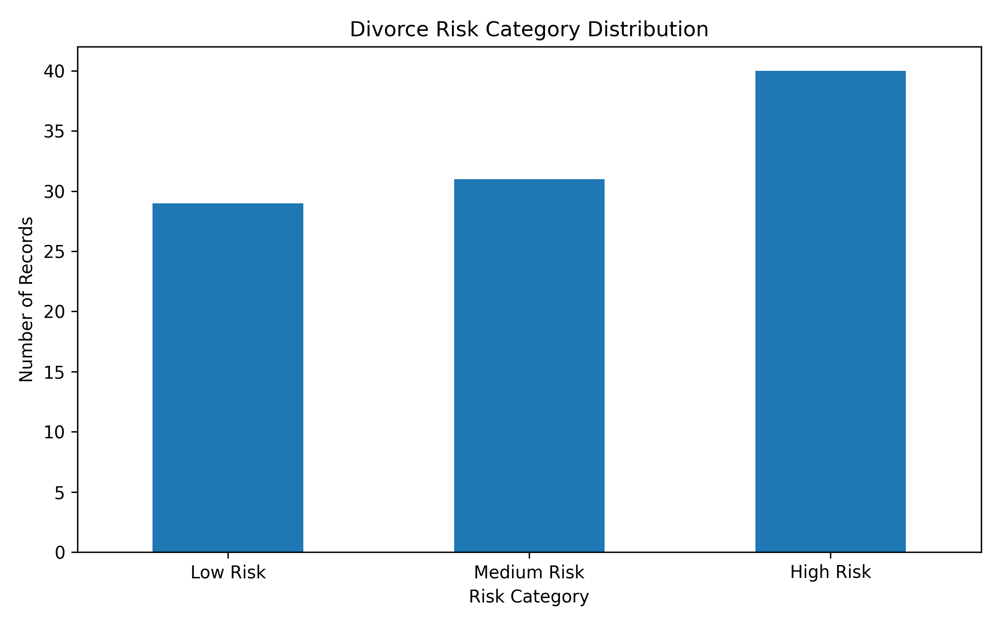
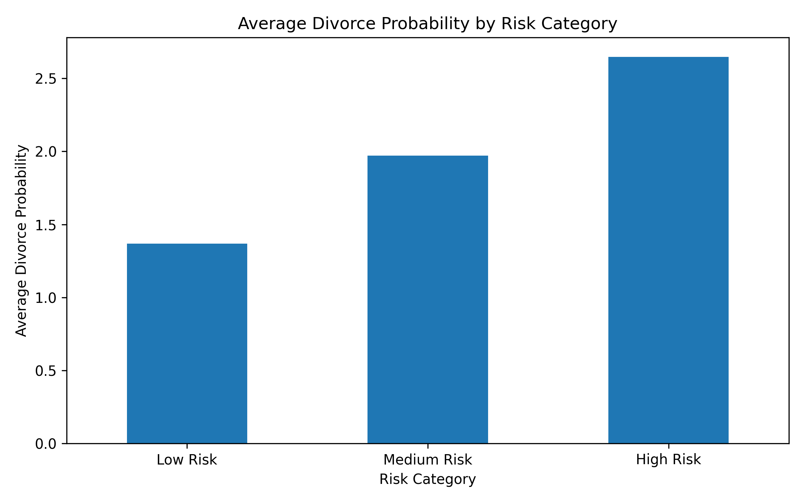
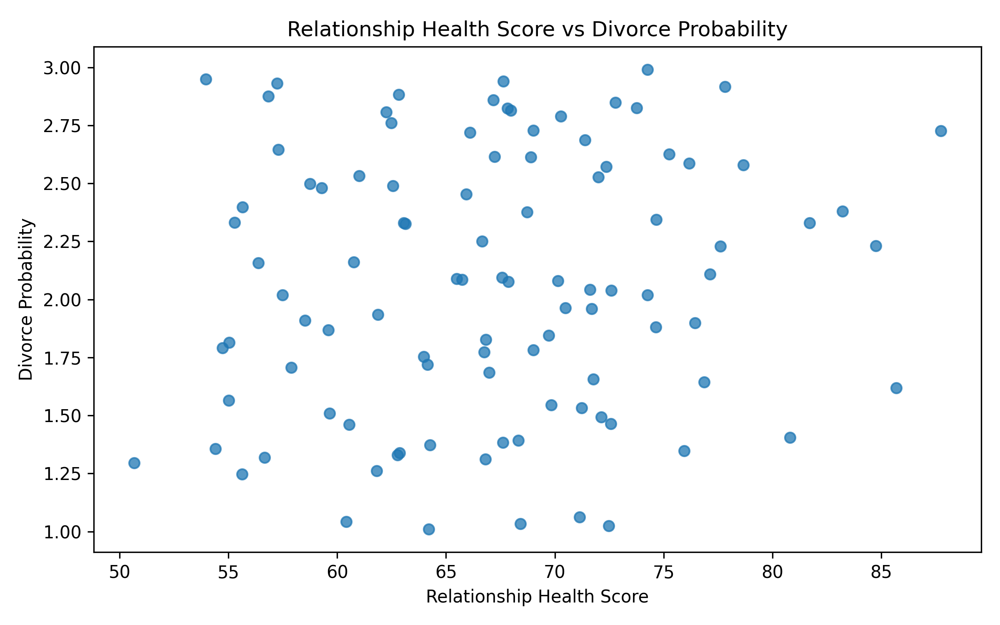
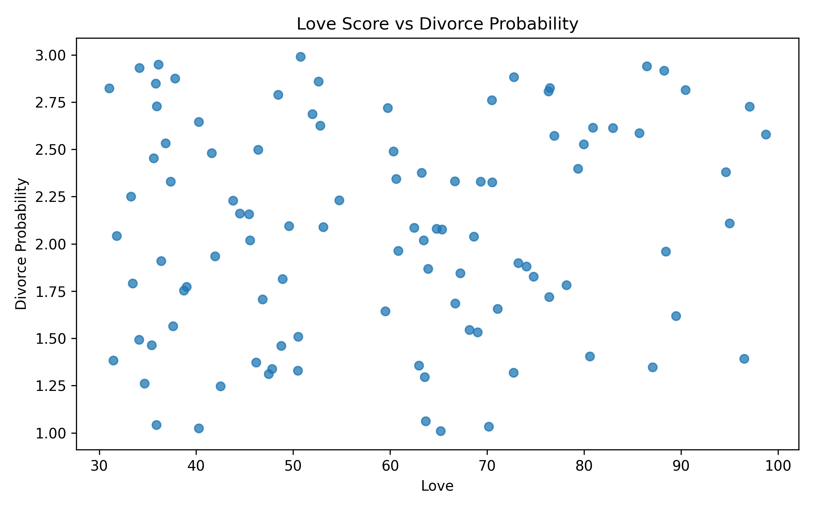
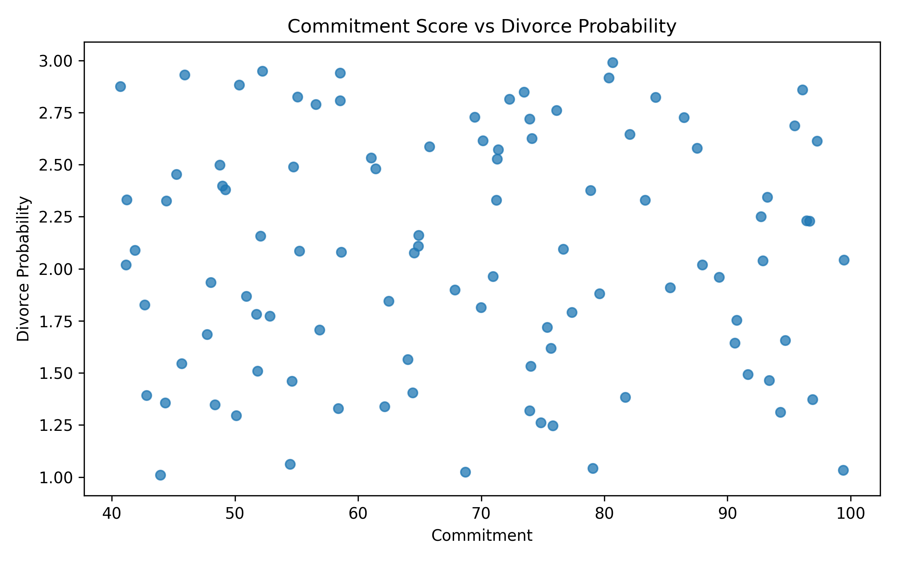
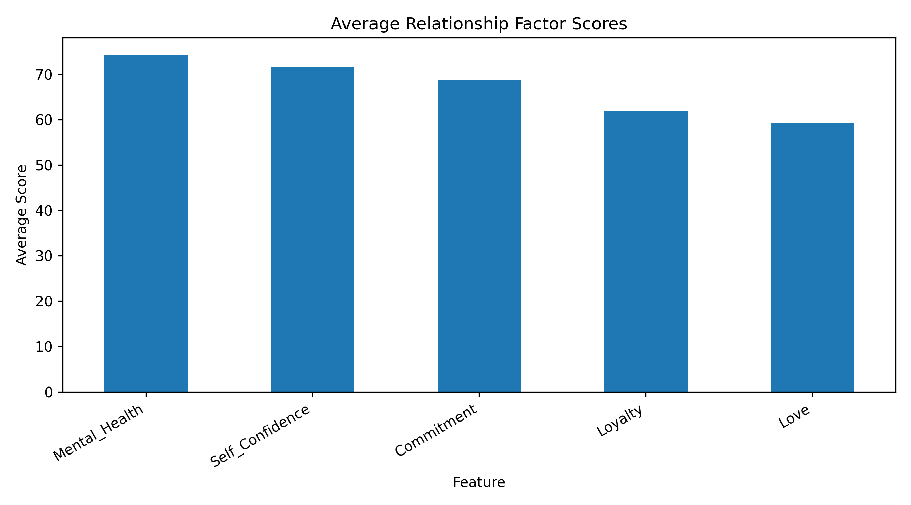
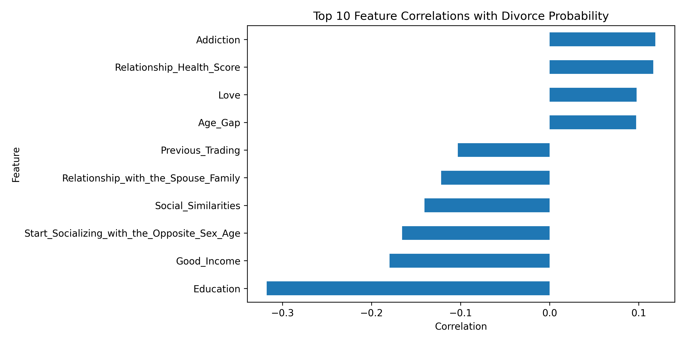

# Marriage & Divorce Risk Analysis

## SQL and Python Exploratory Data Analysis Project

**Author:** Alex
**Tools Used:** SQL, Python, Pandas, Matplotlib, Jupyter Notebook
**Dataset:** Marriage & Divorce Dataset

---

# Executive Summary

This project analyzes a Marriage & Divorce dataset containing 100 observations and 30 relationship-related factors associated with divorce probability.

The objective is to understand how emotional, social, economic, and behavioral variables influence divorce risk through SQL analysis and Python-based exploratory data analysis.

A custom Relationship Health Score was developed, and relationships were categorized into Low Risk, Medium Risk, and High Risk groups based on divorce probability.

The findings suggest that divorce outcomes are influenced by multiple interacting factors rather than a single characteristic such as love or commitment.

---

# Project Objectives

The primary objectives of this project are:

* Explore the Marriage & Divorce dataset using SQL.
* Perform exploratory data analysis using Python.
* Identify factors associated with higher divorce probability.
* Create meaningful visualizations.
* Generate actionable insights.
* Demonstrate end-to-end data analytics skills for portfolio development.

---

# Dataset Overview

| Metric                      | Value               |
| --------------------------- | ------------------- |
| Total Records               | 100                 |
| Total Features              | 30                  |
| Target Variable             | Divorce Probability |
| Average Divorce Probability | 2.067               |
| Minimum Divorce Probability | 1.010               |
| Maximum Divorce Probability | 2.990               |

The dataset includes emotional, behavioral, social, demographic, and family-related attributes.

Examples include:

* Love
* Commitment
* Loyalty
* Mental Health
* Economic Similarity
* Good Income
* Religion Compatibility
* Family Approval
* Addiction
* Previous Marriage
* Family Divorce History

---

# Methodology

The project followed the following workflow:

1. Data Collection
2. Data Cleaning
3. SQL Analysis
4. Feature Engineering
5. Exploratory Data Analysis
6. Data Visualization
7. Insight Generation
8. Reporting

---

# Feature Engineering

## Risk Category

Divorce probability was segmented into three categories:

| Category    | Divorce Probability Range |
| ----------- | ------------------------- |
| Low Risk    | < 1.7                     |
| Medium Risk | 1.7 – 2.3                 |
| High Risk   | > 2.3                     |

---

## Relationship Health Score

A custom Relationship Health Score was created using:

[
Relationship\ Health\ Score =
\frac{
Love + Commitment + Loyalty + Mental\ Health + Self\ Confidence
}{5}
]

This score summarizes overall relationship quality using five core emotional indicators.

Average Relationship Health Score:

**67.15**

---

# SQL Analysis

The SQL analysis included:

## Beginner Queries

* COUNT()
* AVG()
* MIN()
* MAX()
* ORDER BY
* LIMIT

## Intermediate Queries

* CASE Statements
* GROUP BY Analysis
* Risk Categorization
* Aggregate Functions

## Advanced Queries

* Window Functions
* Subqueries
* Ranking Functions
* Custom Relationship Health Score Calculation

These queries helped identify trends and prepare the dataset for visualization.

---

# Exploratory Data Analysis

## 1. Distribution of Divorce Probability

### Findings

* Divorce probability ranges from approximately 1.0 to 3.0.
* The distribution is relatively balanced.
* No extreme skewness is observed.
* The dataset contains sufficient variation for analysis.

### Interpretation

The broad spread of divorce probability values suggests the dataset captures a wide range of relationship outcomes.

---

## 2. Divorce Risk Category Distribution

### Findings

| Risk Category | Count |
| ------------- | ----- |
| Low Risk      | 29    |
| Medium Risk   | 31    |
| High Risk     | 40    |

### Interpretation

* High-risk relationships represent the largest category.
* Approximately 40% of observations belong to the high-risk segment.

### Business Insight

Marriage counselors may prioritize intervention strategies for high-risk groups.

---

## 3. Average Divorce Probability by Risk Category

### Findings

| Risk Category | Average Divorce Probability |
| ------------- | --------------------------- |
| Low Risk      | 1.37                        |
| Medium Risk   | 1.97                        |
| High Risk     | 2.65                        |

### Interpretation

The segmentation clearly separates relationships based on risk level.

---

## 4. Relationship Health Score vs Divorce Probability

### Findings

* No strong linear relationship is observed.
* High and low divorce probabilities occur across various health score ranges.

### Interpretation

Relationship quality alone does not fully explain divorce outcomes.

Additional social, behavioral, and economic factors likely contribute.

---

## 5. Love Score vs Divorce Probability

### Findings

* Love scores range between approximately 30 and 100.
* Divorce probability varies significantly at all love levels.

### Interpretation

Love alone is not a sufficient predictor of marital success.

---

## 6. Commitment Score vs Divorce Probability

### Findings

* Commitment scores range between approximately 40 and 100.
* No strong direct relationship is visible.

### Interpretation

Commitment contributes to relationship quality but is insufficient as a standalone indicator.

---

## 7. Average Relationship Factor Scores

### Findings

| Factor          | Average Score |
| --------------- | ------------- |
| Mental Health   | 74.4          |
| Self Confidence | 71.4          |
| Commitment      | 68.7          |
| Loyalty         | 62.0          |
| Love            | 59.3          |

### Interpretation

Mental health and self-confidence show the highest average values among emotional factors.

Love exhibits the lowest average score.

---

## 8. Correlation Analysis

### Top Correlated Features

| Feature     | Correlation |
| ----------- | ----------- |
| Education   | -0.32       |
| Good Income | -0.18       |
| Addiction   | +0.12       |
| Love        | +0.10       |
| Age Gap     | +0.10       |

### Interpretation

#### Education

Higher education levels are associated with lower divorce probability.

#### Good Income

Financial stability appears to reduce relationship risk.

#### Addiction

Addiction demonstrates a positive association with divorce probability.

#### Age Gap

Larger age differences may slightly increase relationship risk.

---

# Key Insights

## Insight 1

Approximately 40% of observations belong to the high-risk category.

---

## Insight 2

Education exhibits the strongest negative correlation with divorce probability.

---

## Insight 3

Financial stability may contribute to stronger relationships.

---

## Insight 4

Addiction is positively associated with divorce probability.

---

## Insight 5

Relationship outcomes cannot be explained solely by love or commitment.

Multiple variables influence marital stability.

---

# Recommendations

Based on the findings:

1. Focus counseling efforts on high-risk groups.
2. Encourage educational and personal development initiatives.
3. Address addiction-related issues through early intervention.
4. Consider broader social and economic factors during relationship assessments.
5. Develop composite relationship metrics rather than relying on single indicators.

---

# Limitations

* Small dataset size (100 records).
* Correlation does not imply causation.
* Results may not generalize across different cultures or populations.
* Additional variables may influence divorce outcomes.

---

# Future Work

Potential future extensions include:

* Machine Learning Classification Models
* Random Forest Analysis
* XGBoost Prediction Models
* SHAP Explainability Analysis
* Feature Importance Ranking
* Predictive Divorce Risk Scoring System

---

# Conclusion

This project demonstrates a complete data analytics workflow using SQL and Python to investigate factors associated with divorce probability.

The analysis reveals that divorce outcomes are influenced by a combination of emotional, economic, behavioral, and social factors. While variables such as education, income, and addiction show measurable relationships with divorce probability, no single factor alone explains relationship success.

The project highlights practical skills in:

* SQL Analysis
* Data Cleaning
* Exploratory Data Analysis
* Feature Engineering
* Data Visualization
* Business Insight Generation
* Technical Documentation

These skills are directly applicable to Data Analyst, Business Intelligence, and Junior Data Science roles.

## License

This project code is licensed under the MIT License.

## Dataset Citation

Dataset used in this project:

Mousavi, S. M. H., MiriNezhad, S. Y., & Lyashenko, V.  
"An Evolutionary-Based Adaptive Neuro-Fuzzy Expert System as a Family Counselor Before Marriage with the Aim of Divorce Rate Reduction."  
2nd International Conference on Research Knowledge Base in Computer, Tehran, Iran, 2017.

The dataset is used for educational and portfolio purposes with proper citation.
